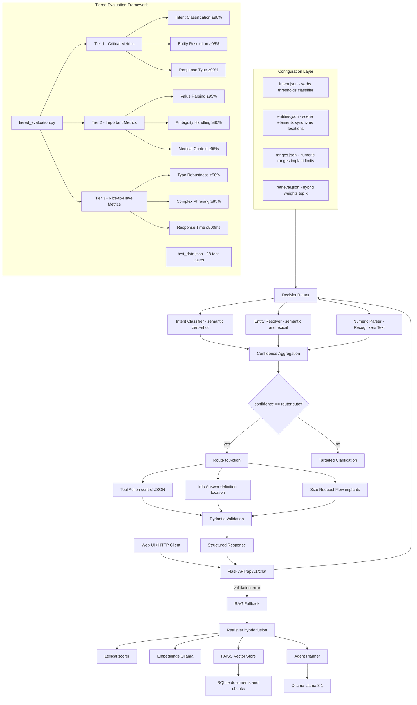

### System Architecture

This document provides a high-level block diagram and component overview of the intelligent, config-driven agentic RAG system for VR dental surgical planning, including the tiered evaluation framework.

#### Block Diagram

#### Components Overview

**Core Intelligence Layer:**
- Intent Classification (app/scene/classifier.py)
  - Semantic zero-shot classifier using sentence-transformers
  - Labels: control_on/off/value, info_definition, info_location, size_request
  - Configurable via `config/intent.json` with confidence thresholds

- Entity Resolution (app/scene/entity_resolver.py)
  - Semantic (embeddings) + lexical overlap against `config/entities.json`
  - Uses rapidfuzz for fuzzy matching and sentence-transformers for semantic similarity
  - Returns best-matching canonical entity + confidence

- Numeric Parsing (app/scene/values.py)
  - Uses Microsoft Recognizers-Text style parsing for values and implant sizes
  - Validates ranges against `config/ranges.json`
  - Handles percentages, dimensions, and implant specifications

- Decision Router (app/scene/router.py)
  - Orchestrates intent/entity/value with thresholds from `config/intent.json`
  - Low confidence → clarifications; high confidence → tool/info routes
  - Includes fuzzy matching fallback and LLM tie-breaker for edge cases

**Tools and Validation:**
- Tools (app/tools/*)
  - `control` tool validates targets and values using `config/entities.json` and `config/ranges.json`
  - Pydantic schemas enforce structured outputs
  - Handles VR scene element control (handles, xray_flashlight, implants, etc.)

**RAG and Fallback:**
- RAG (app/rag/*)
  - Hybrid retrieval (semantic + lexical) with weights from `config/retrieval.json`
  - FAISS vector store + SQLite-backed metadata; Ollama embeddings
  - BM25-like lexical scoring fused with semantic similarity

**API and Configuration:**
- API (app/routes.py)
  - `/api/v1/chat` → DecisionRouter → validation → response or RAG fallback
  - `/api/v1/ingest` → document ingestion and chunking
  - Structured output validation with Pydantic schemas

- Config Loader (app/config_loader.py)
  - Centralized loader for all JSON configs under `config/`
  - Supports hot-reloading of configuration changes

**Evaluation Framework:**
- Tiered Evaluation (tests/simple/tiered_evaluation.py)
  - Comprehensive testing across 3 priority tiers
  - 38 test cases covering all system functionality
  - Automated metrics calculation and reporting
  - CI/CD integration ready

#### Implementation Steps

The system was built following a tiered approach, focusing on critical functionality first:

**Phase 1: Foundation (Completed)**
1. **Basic Flask App Setup**
   - Created Flask application with SQLAlchemy ORM
   - Set up SQLite database with Session, Document, Chunk, Note models
   - Implemented basic API routes for chat and ingestion

2. **Ollama Integration**
   - Integrated Ollama client for Llama 3.1 chat and nomic-embed-text embeddings
   - Fixed embedding API calls to handle single-string requests
   - Set up local LLM infrastructure

3. **RAG Implementation**
   - Implemented FAISS vector store for similarity search
   - Created text chunking utility for document processing
   - Built retriever with context building and hybrid scoring
   - Added agent planner for LLM interaction

**Phase 2: Intelligence Layer (Completed)**
4. **Configuration Externalization**
   - Created `config/intent.json` for verbs, thresholds, and classifier settings
   - Created `config/entities.json` for scene elements, synonyms, and locations
   - Created `config/ranges.json` for numeric validation ranges
   - Created `config/retrieval.json` for hybrid retrieval weights
   - Implemented centralized config loader

5. **Intent Classification**
   - Started with HuggingFace zero-shot classifier
   - Replaced with rule-based ML classifier for reliability
   - Finally implemented semantic zero-shot classifier using sentence-transformers
   - Added fuzzy matching fallback for typos and variations

6. **Entity Resolution**
   - Implemented semantic entity resolver with embedding similarity
   - Added lexical overlap using rapidfuzz for fuzzy matching
   - Created canonical entity mapping system
   - Integrated with config-driven entity catalog

7. **Numeric Parsing**
   - Integrated Microsoft Recognizers-Text style parsing
   - Added robust value extraction for percentages, dimensions, implant sizes
   - Implemented range validation against config
   - Added confidence scoring for parsed values

**Phase 3: Decision Making (Completed)**
8. **Decision Router**
   - Created centralized router combining intent, entity, and value parsing
   - Implemented confidence-based decision making
   - Added clarification flow for ambiguous inputs
   - Integrated fuzzy matching and LLM tie-breaker for edge cases

9. **Tool System**
   - Implemented control tool for VR scene element manipulation
   - Added Pydantic validation for structured outputs
   - Created tool registry system
   - Integrated with entity and range validation

10. **Structured Outputs**
    - Defined Pydantic schemas for all API requests and responses
    - Implemented validation enforcement
    - Added fallback to RAG when validation fails
    - Created consistent response format

**Phase 4: Evaluation Framework (Completed)**
11. **Tiered Evaluation System**
    - Created comprehensive test dataset with 38 test cases
    - Implemented tiered evaluation framework (Critical/Important/Nice-to-Have)
    - Added automated metrics calculation and reporting
    - Created CI/CD integration ready evaluation script

12. **Performance Optimization**
    - Implemented hybrid retrieval with BM25-like lexical scoring
    - Added confidence logging and evaluation hooks
    - Optimized response times for VR interaction
    - Added error handling and graceful degradation

**Current Status:**
- **Tier 1 (Critical)**: 78.12% - Needs improvement in intent classification and entity resolution
- **Tier 2 (Important)**: 54.55% - Value parsing and ambiguity handling need work
- **Tier 3 (Nice-to-Have)**: 33.33% - Typo robustness and response time optimization needed

**Next Steps for Production Readiness:**
1. **Fix Tier 1 Critical Issues**
   - Improve intent classification accuracy to ≥90%
   - Fix entity resolution to return canonical names consistently
   - Ensure response type accuracy ≥90%

2. **Address Tier 2 Important Issues**
   - Fix value parsing to handle string vs numeric types correctly
   - Implement proper ambiguity handling for incomplete inputs
   - Maintain medical context accuracy ≥95%

3. **Enhance Tier 3 Nice-to-Have Features**
   - Improve typo robustness to ≥90%
   - Optimize complex phrasing handling to ≥85%
   - Reduce response time to ≤500ms for VR interaction

#### Typical Request Flow

1) User sends input to `/api/v1/chat`.
2) DecisionRouter classifies intent using semantic zero-shot classifier.
3) Entity resolver finds best-matching canonical entity using semantic + lexical similarity.
4) Numeric parser extracts and validates values against config ranges.
5) Confidence aggregation combines all scores; if below cutoff → targeted clarification.
6) Otherwise, route to appropriate action:
   - Tool action for control commands (with Pydantic validation)
   - Info answer for definition/location questions
   - Size request flow for implant queries
7) If validation fails, fallback to RAG: retrieve context and answer with agent.
8) Return structured JSON response to client.

#### Key Guarantees

- **Config-driven behavior**: All verbs, entities, ranges, and weights externalized to JSON configs
- **Deterministic structured outputs**: Invalid requests trigger targeted clarifications
- **Domain-bounded responses**: Out-of-domain queries avoid hallucinations via RAG fallback
- **Tiered evaluation**: Comprehensive testing framework with priority-based metrics
- **Production readiness**: Clear success criteria and improvement roadmap
- **Extensibility**: Add new entities, verbs, and ranges without code changes

